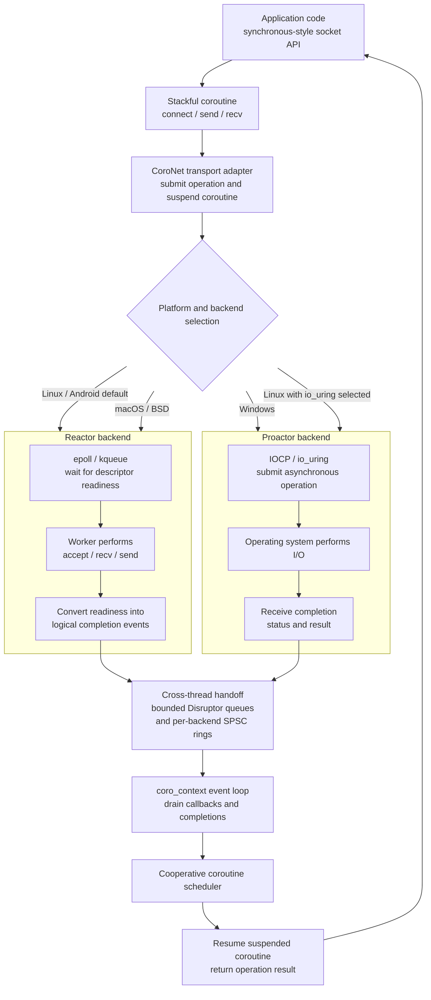

# TurboNet CoroNet

High-performance networking core library providing essential network protocols and utilities with direct host/port socket APIs plus URL helpers for server endpoints.

## Features

- **Direct Socket API**: Simple host/port connects plus dedicated helpers for WebSocket and pipes
- **Coroutine I/O**: Native cross-platform I/O via IOCP (Windows), epoll (Linux), kqueue (macOS)
- **Core Design**: Synchronous-style code with coro execution via coroutines
- **Connection Pool**: Coroutine-aware connection pooling for high-concurrency workloads
- **Multiple Protocols**: TCP, UDP, KCP, TLS, Named Pipes, WebSocket, Linux VSOCK
- **Memory Management**: Efficient arena-based memory pooling and zero-copy buffers
- **Configuration System**: Runtime configuration with hashmap-backed storage
- **DNS Resolution**: High-performance DNS resolver using c-ares
- **Multithreading**: Worker-based architecture for multi-threaded applications
- **Statistics**: Built-in performance monitoring and stats collection

## WebSocket Session Adapters

`coro_websocket_t` provides the shared WebSocket frame/message session after a
transport handshake has completed. The same session API supports client and
server masking rules for `CORO_WEBSOCKET_TRANSPORT_HTTP1`,
`CORO_WEBSOCKET_TRANSPORT_HTTP2`, and `CORO_WEBSOCKET_TRANSPORT_HTTP3`.

The session owns RFC 6455 frame parsing, fragmentation, bounded message
assembly, control-frame handling, and close state. HTTP/1.1 Upgrade, HTTP/2
RFC 8441 extended CONNECT, and HTTP/3 QUIC/QPACK setup remain transport
adapter responsibilities. The HTTP/3 kind is currently an API contract only;
it does not create or drive a QUIC connection.

## Processing Model

CoroNet exposes synchronous-style networking APIs over stackful coroutines. A
network operation suspends only the calling coroutine; it does not block the
`coro_context` event-loop thread. When the operation completes, the runtime
marks the coroutine ready and the cooperative scheduler resumes it with the
result.

The public API presents a unified completion-driven model while the native I/O
mechanism is selected by platform and backend configuration:



| Platform / configuration | Native mechanism | Backend model | API-visible model |
|--------------------------|------------------|---------------|-------------------|
| Windows                  | IOCP             | Proactor      | Completion-driven |
| Linux default            | epoll            | Reactor       | Completion-driven |
| Linux with io_uring      | io_uring         | Proactor      | Completion-driven |
| Android                  | epoll            | Reactor       | Completion-driven |
| macOS / BSD              | kqueue           | Reactor       | Completion-driven |

Disruptor queues provide bounded cross-thread handoff; they do not select the
I/O model and are not the coroutine scheduler. Coroutines may be organized in
an actor-like style by an application, but CoroNet itself is not an Actor
runtime: it does not provide a mailbox or isolated state for each coroutine.

## Quick Start

### Coroutine Client

```c
#include "turbo_coro_socket.h"
#include "turbo_coro_context.h"

void network_task(coro_t *co, void *arg) {
  coro_context_t *ctx = (coro_context_t *)arg;
  coro_socket_t *socket = coro_socket_create_tcpv4(ctx);

  // Connect (suspends coroutine until done)
  if (coro_socket_connect(socket, "example.com", 8080) == 0) {
      // Send and receive (each call suspends until complete)
      coro_socket_send(socket, "Hello", 5);

      char *data; size_t len;
      if (coro_socket_recv(socket, &data, &len) == 0) {
          printf("Received: %.*s\n", (int)len, data);
          coro_socket_free_recv(data);
      }
  }

  coro_socket_destroy(socket);
}

int main(void) {
  coro_context_t *ctx = coro_context_create(NULL);

  // Spawn coroutine (automatic lifecycle management)
  coro_context_spawn(ctx, network_task, ctx);

  // Run event loop
  coro_context_run(ctx, TURBO_RUN_DEFAULT);

  coro_context_destroy(ctx);
  return 0;
}
```

> **Note:** Use `coro_context_spawn()` for automatic coroutine management.
> The low-level `coro_create()`/`coro_resume()`/`coro_destroy()` API
> is available for advanced use cases but requires manual lifecycle management.

### High-Frequency Scheduler Workloads

```c
#include "turbo_coro.h"
#include "CoroNet/turbo_coro_object_pool.h"

static void worker(coro_t *co, void *arg) {
  int *counter = (int *)arg;
  UNUSED(co);
  (*counter)++;
}

int main(void) {
  coro_context_t *ctx = coro_context_create(NULL);
  coro_scheduler_t *sched = coro_scheduler_create();
  coro_object_pool_config_t cfg = CORO_OBJECT_POOL_CONFIG_DEFAULT;
  coro_object_pool_t *pool = coro_object_pool_create(&cfg, ctx);
  int counter = 0;

  for (int i = 0; i < 1000; ++i) {
    coro_spawn_pooled(sched, pool, worker, &counter);
  }

  coro_scheduler_run(sched);

  coro_object_pool_destroy(pool);
  coro_scheduler_destroy(sched);
  coro_context_destroy(ctx);
  return 0;
}
```

Use `coro_spawn_pooled()` when you already own a long-lived scheduler and need
to launch many short-lived coroutines. It keeps scheduler semantics but avoids
the full `coro_create()` / `coro_destroy()` cost on every task.

Servers that use `coro_context_spawn()` or socket listeners should size the
context-owned pool at creation instead of creating a second pool:

```c
coro_object_pool_config_t cfg = {
  .initial_capacity = 16,
  .max_capacity = 100008,
  .stack_size = 64 * 1024
};
coro_context_t *ctx = coro_context_create_ex(NULL, &cfg);
```

The legacy `coro_context_create()` remains equivalent to passing a NULL pool
configuration. Stack size is a resource and safety boundary; reducing it
requires workload-specific stack-depth testing.

`coro_context_set_stream_recv_buffer_size()` changes the capacity of each of
the two ping-pong receive buffers allocated by streams created afterward. The
default remains 128 KiB per buffer; protocol runtimes with their own framing
and reassembly may select a smaller context-local chunk before creating sockets.

### Coroutine Server

```c
#include "turbo_coro_socket.h"

void on_connection(coro_socket_t *client, void *arg) {
  char *data; size_t len;
  while (coro_socket_recv(client, &data, &len) == 0) {
    if (len == 0) break;
    coro_socket_send(client, data, len); // echo service
    coro_socket_free_recv(data);
  }
}

int main(void) {
  coro_context_t *ctx = coro_context_create(NULL);
  coro_socket_t *server = coro_socket_create_tcpv4(ctx);
  
  // Listen on URL (automatic transport detection)
  coro_socket_listen_url(server, "tcp://0.0.0.0:8080", on_connection, NULL);
  
  coro_context_run(ctx, TURBO_RUN_DEFAULT);
  
  coro_socket_destroy(server);
  coro_context_destroy(ctx);
  return 0;
}
```

### Linux VSOCK

VSOCK uses a typed `{cid, port}` endpoint instead of a hostname or URI. This
keeps VM socket addresses out of DNS, proxy, and URL parsing paths.

```c
#include "turbo_coro_context.h"
#include "turbo_coro_socket.h"

static void vsock_client(coro_t *co, void *arg) {
  coro_context_t *ctx = (coro_context_t *)arg;
  const turbo_vsock_endpoint_t endpoint = {
      TURBO_VSOCK_CID_HOST, UINT32_C(7000)};
  coro_socket_t *socket = coro_socket_create_vsock(ctx);

  UNUSED(co);
  if (!socket) return;

  if (coro_socket_connect_vsock(socket, &endpoint) == 0) {
    static const char message[] = "hello";
    (void)coro_socket_send(socket, message, sizeof(message) - 1);
  }
  coro_socket_destroy(socket);
}

int main(void) {
  coro_context_t *ctx;

  if (!turbo_vsock_is_available()) return 1;
  ctx = coro_context_create(NULL);
  if (!ctx) return 1;

  if (coro_context_spawn(ctx, vsock_client, ctx) != 0) {
    coro_context_destroy(ctx);
    return 1;
  }
  coro_context_run(ctx, TURBO_RUN_DEFAULT);
  coro_context_destroy(ctx);
  return 0;
}
```

A managed VSOCK server uses the same per-connection handler contract as TCP:

```c
#include "turbo_coro_context.h"
#include "turbo_coro_socket.h"

static void on_vsock_connection(coro_socket_t *client, void *arg) {
  char *data = NULL;
  size_t len = 0;

  UNUSED(arg);
  if (coro_socket_recv(client, &data, &len) == 0) {
    (void)coro_socket_send(client, data, len);
    coro_socket_free_recv(data);
  }
}

int main(void) {
  const turbo_vsock_endpoint_t bind_endpoint = {
      TURBO_VSOCK_CID_ANY, UINT32_C(7000)};
  coro_context_t *ctx;
  coro_socket_t *server;

  if (!turbo_vsock_is_available()) return 1;
  ctx = coro_context_create(NULL);
  if (!ctx) return 1;
  server = coro_socket_create_vsock(ctx);
  if (!server ||
      coro_socket_listen_vsock(server, &bind_endpoint,
                               on_vsock_connection, NULL) != 0) {
    coro_socket_destroy(server);
    coro_context_destroy(ctx);
    return 1;
  }

  coro_context_run(ctx, TURBO_RUN_DEFAULT);
  coro_socket_destroy(server);
  coro_context_destroy(ctx);
  return 0;
}
```

`turbo_vsock_is_available()` reports whether the running Linux kernel permits
creating an `AF_VSOCK` stream socket. Builds without Linux VSOCK headers keep
the API available but fail VSOCK creation or use with
`TURBO_EPROTONOSUPPORT`. Remote endpoints reject
`TURBO_VSOCK_CID_ANY` and `TURBO_VSOCK_PORT_ANY`. Linger and socket buffer
controls are supported; TCP keepalive is rejected with `TURBO_ENOTSUP`.

VSOCK support currently targets Linux `AF_VSOCK`. Windows `AF_HYPERV` is a
different address family and is not handled by these APIs. See
[vsock(7)](https://man7.org/linux/man-pages/man7/vsock.7.html) and the
[Linux virtio-vsock documentation](https://docs.kernel.org/virtio/vsock.html).

### Connection Pool

```c
#include "turbo_connection_pool.h"

void worker(coro_t *co, void *arg) {
  coro_pool_t *pool = (coro_pool_t *)arg;
  coro_socket_t *c;

  if (coro_pool_borrow(pool, &c) != 0) return;

  coro_socket_send(c, "hello", 5);
  char *data; size_t len;
  coro_socket_recv(c, &data, &len);
  coro_socket_free_recv(data);

  coro_pool_return(pool, c);
}
```

Protocol-aware pools can register a connection initializer before
`coro_pool_open()`. The initializer runs exactly once after each new transport
connection is established, so protocols can complete handshakes such as
AUTH/SELECT before the socket becomes borrowable. Borrowers must call
`coro_pool_discard()` instead of `coro_pool_return()` when framing or protocol
state is no longer reusable.

### WebSocket Server Policy

Protocol servers can constrain WebSocket admission and message delivery before
starting the listener:

```c
coro_ws_server_config_t ws = CORO_WS_SERVER_CONFIG_DEFAULT;
coro_socket_t *server = coro_socket_create(ctx, CORO_SOCKET_TCP_V4);

ws.path = "/mqtt";          /* exact request-target match */
ws.subprotocol = "mqtt";    /* required offered token and selected token */
ws.max_message_size = 1024 * 1024;
ws.binary_only = 1;

if (!server || coro_socket_set_ws_server_config(server, &ws) != 0 ||
    coro_socket_listen_ws(server, "0.0.0.0", 8080, 0,
                          on_connection, NULL) != 0) {
  /* fail startup and report the configuration error */
}
```

Set the policy before connect/listen starts. CoroNet copies the strings into the
listener, and every accepted socket inherits an immutable copy. `max_message_size`
applies to both one-frame messages and the cumulative size of fragmented messages.
`binary_only` rejects text data with close code 1003; oversized messages use 1009.
Leaving a field at its default preserves the general-purpose WebSocket behavior.

### TLS/WSS Certificates

TLS and WSS listeners load a PEM certificate chain and its matching PEM private
key from the process environment. Configure these variables before creating the
listener:

```powershell
$env:TURBONET_TLS_CERT_FILE = "C:\\certs\\server-chain.pem"
$env:TURBONET_TLS_KEY_FILE = "C:\\certs\\server-key.pem"
```

```sh
export TURBONET_TLS_CERT_FILE=/etc/turbonet/server-chain.pem
export TURBONET_TLS_KEY_FILE=/etc/turbonet/server-key.pem
```

Clients verify the peer by default. Set `TURBONET_TLS_CA_FILE` to a PEM CA bundle,
or `TURBONET_TLS_CA_PATH` to an OpenSSL CA directory, when the certificate is not
in the platform/default trust store. The hostname passed to the TLS or WSS
connect helper must match a certificate subject alternative name.

Per-socket client trust and optional client certificates can be configured before
connect; the strings are copied by `coro_socket_set_tls_client_config()`:

```c
turbo_tls_client_config_t tls = {0};
tls.ca_file = "/etc/turbonet/ca.pem";
tls.cert_file = "/etc/turbonet/client.pem"; /* optional mutual TLS */
tls.key_file = "/etc/turbonet/client-key.pem";
tls.verify_peer = 1;

coro_socket_t *socket = coro_socket_create(ctx, CORO_SOCKET_TLS);
if (!socket || coro_socket_set_tls_client_config(socket, &tls) != 0) {
  /* fail startup and report the configuration error */
}
/* Use coro_socket_connect() for TLS or coro_socket_connect_ws(..., 1) for WSS. */
```

Missing, unreadable, or mismatched listener certificate/key files fail the TLS or
WSS setup. Keep private keys out of source control and logs.

### TLS/WSS Channel Binding

`coro_socket_tls_export_channel_binding()` returns the 32-byte
[`tls-exporter` channel binding defined by RFC 9266](https://www.rfc-editor.org/rfc/rfc9266.html)
for a fully-open TLS 1.3 or WSS connection. It works for outbound clients and
accepted server sockets, is read-only, and clears the caller's output buffer on failure.
The binding identifies the current TLS connection but is not secret and must
not be used as encryption key material. Calls on raw TCP/WS, an incomplete TLS
handshake, a non-TLS-1.3 connection, or a client connection without successful
peer-certificate verification fail explicitly.

## Supported URL Formats

| Protocol   | URL Format                  | Example                         | Description                    |
|------------|-----------------------------|---------------------------------|--------------------------------|
| TCP        | `tcp://host:port`           | `tcp://127.0.0.1:8080`          | Standard TCP connection        |
| TLS/SSL    | `tls://host:port`           | `tls://example.com:8883`        | Encrypted TCP with TLS         |
|            | `https://host:port`         | `https://api.example.com:443`   | HTTPS (same as TLS)            |
| UDP        | `udp://host:port`           | `udp://239.0.0.1:9999`          | Connectionless UDP             |
| KCP        | `kcp://host:port`           | `kcp://10.0.0.1:7000`           | Reliable UDP with KCP          |
| Named Pipe | `pipe://name`               | `pipe://myservice`              | Local IPC (cross-platform)     |
| WebSocket  | `ws://host:port/path`       | `ws://localhost:8080/chat`      | WebSocket over HTTP            |
|            | `wss://host:port/path`      | `wss://example.com:443/api`     | WebSocket over HTTPS           |

VSOCK is intentionally absent from this table. Use
`coro_socket_connect_vsock()` or `turbo_stream_connect_vsock()` with a typed
CID/port endpoint; VSOCK does not resolve hostnames or use outbound proxies.

### URL Helper Functions

```c
#include "turbo_url.h"

// Validate a URL
if (turbo_url_is_valid("tcp://example.com:8080")) {
  printf("Valid URL\n");
}

// Extract scheme from URL
char scheme[16];
turbo_url_get_scheme("tls://secure.example.com:443", scheme, sizeof(scheme));
printf("Scheme: %s\n", scheme);  // "tls"

// Build URL from components
char url[256];
turbo_url_build("tcp", "127.0.0.1", 8080, NULL, url, sizeof(url));
printf("URL: %s\n", url);  // "tcp://127.0.0.1:8080"

// Build pipe URL
turbo_url_build("pipe", NULL, 0, "myservice", url, sizeof(url));
printf("URL: %s\n", url);  // "pipe://myservice"
```

## Configuration

```c


// Set TCP buffer sizes
turbo_tcp_config_set_recv_buffer_size(256 * 1024);
turbo_tcp_config_set_send_buffer_size(256 * 1024);

// Get configuration values
int buffer_size = turbo_tcp_config_get_recv_buffer_size();

// Or use generic config API
turbo_config_set_int("tcp.recv_buffer_size", 65536);
int size = turbo_config_get_int("tcp.recv_buffer_size", 8192);
```

## Building

```bash
# Add to your CMake project
find_package(TurboNet REQUIRED)
target_link_libraries(your_target TurboNet::CoroNet)
```

Linux VSOCK loopback tests are opt-in because they require a kernel and
host/guest configuration that supports `VMADDR_CID_LOCAL`:

```bash
cmake --preset linux-dev-user \
  -DTURBO_ENABLE_VSOCK_INTEGRATION_TESTS=ON
cmake --build --preset linux-dev-user --target test_vsock
ctest --preset linux-dev-user -R test_vsock --output-on-failure
```

## Dependencies

- c-ares (DNS resolution; built as a static library by the repository vcpkg overlay)
- KCP
- OpenSSL

## Examples

See the `examples/` directory for complete working examples:

- `sync_client.c` - Synchronous blocking client
- `coro_client_example.c` - Coroutine-based client
- `coro_server_example.c` - Coroutine-based echo server
- `coro_pool_example.c` - Connection pool with worker coroutines
- `ws_client.c` - WebSocket client example

## Documentation

See the API reference in the `/docs` directory for detailed function documentation.

## Licensing

See LICENSE file in the project root.
